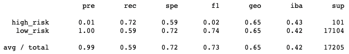
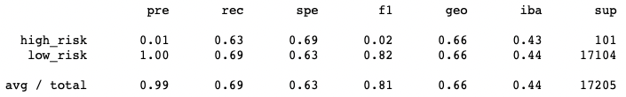
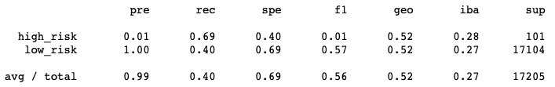
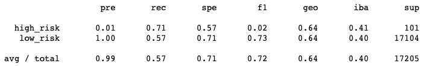
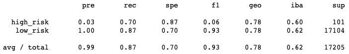
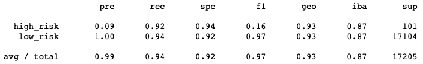

# Supervised Machine Learning to Predict Credit Risk

## Overview
The purpose of this project was to use supervised machine learning to build and evaluate models for predicting credit risk. Since credit risk is a case of unbalanced classification, with good loans greatly outnumbering bad ones, the project employed various models using resampling and ensemble methods. The performance of the models was compared to develop a recommendation for which, if any, should be used to predict credit risk. 

## Results
All analysis was performed using a [credit dataset](Resources/LoanStats_2019Q1.csv) from peer-to-peer lending company LendingClub. Two Python scripts using Pandas in Jupyter Notebook were developed to preprocess the data and build and evaluate the machine learning models: one for the [models using resampling](Notebooks/credit_risk_resampling.ipynb) and the other for the [ensemble models](Notebooks/credit_risk_ensemble.ipynb). Details on the performance of each model are outlined below.

### Random Oversampling
For the model using the RandomOverSampler algorithm:
-    The balanced accuracy score was 0.65.
-    Precision score for predicting high risk was 0.01.
-    Recall score for predicting high risk was 0.72.

### SMOTE Oversampling
For the model using the SMOTE algorithm:
-    The balanced accuracy score was 0.66.
-    Precision score for predicting high risk was 0.01.
-    Recall score for predicting high risk was 0.63.

### Cluster Centroids Undersampling
For the model using the ClusterCentroids algorithm:
-    The balanced accuracy score was 0.54.
-    Precision score for predicting high risk was 0.01.
-    Recall score for predicting high risk was 0.69.

### SMOTEENN Combination Over- and Undersampling
For the model using the SMOTEENN algorithm:
-    The balanced accuracy score was 0.64.
-    Precision score for predicting high risk was 0.01.
-    Recall score for predicting high risk was 0.71.

### Balanced Random Forest Classifier
For the model using the BalancedRandomForestClassifier algorithm:
-    The balanced accuracy score was 0.79.
-    Precision score for predicting high risk was 0.03.
-    Recall score for predicting high risk was 0.70.

### Easy Ensemble AdaBoost Classifier
For the model using the EasyEnsembleClassifier algorithm:
-    The balanced accuracy score was 0.93.
-    Precision score for predicting high risk was 0.09.
-    Recall score for predicting high risk was 0.92.

## Summary
Overall, the machine learning model using the EasyEnsembleClassifier algorithm performed much better than the five other models. Its accuracy score of 0.93 indicates that the model’s predictions were correct 93% of the time. The model had a high recall score for predicting high risk (0.92), indicating that when loans were actually high risk, the model did a good job of correctly identifying them as such. The model’s precision score of 0.09 was higher than for the other five models, but still very low. This precision score means that loans identified as high risk only had a 9% likelihood of actually being high risk. Given that the purpose of a model to predict credit risk is to protect lenders from making high risk loans, this low precision may be an acceptable tradeoff for the model’s high recall. I would recommend continuing to build and evaluate additional models using other algorithms, feature scaling, and/or feature selection. If no other model can improve upon the performance of the current EasyEnsembleClassifier one, then I would recommend its use for predicting credit risk.
